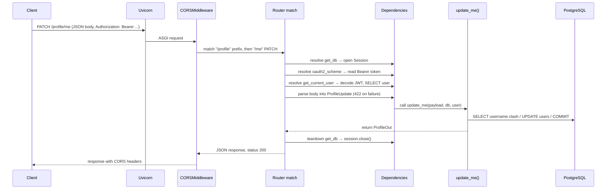

# FastAPI Concepts

This guide explains the ideas you need to read and extend this codebase. It assumes you already know backend development in general (HTTP, REST, ORMs, dependency injection, JWTs) but have not used FastAPI before. Every concept is illustrated with code taken from this repository.

## 1. What FastAPI is

FastAPI is a Python web framework for building HTTP APIs. Three ideas define it:

1. **Type hints drive everything.** You declare the shape of a request with ordinary Python type annotations, and FastAPI uses them to parse, validate, document, and serialize. There is no separate schema language or annotation layer.
2. **Pydantic does the validation.** Pydantic is a data-validation library. FastAPI is built on top of it; you define request and response shapes as Pydantic models.
3. **It is an ASGI application.** FastAPI does not include a server. A separate ASGI server (here, Uvicorn) accepts connections and hands each request to the FastAPI app object.

```
Client ──HTTP──▶ Uvicorn (ASGI server) ──▶ FastAPI app ──▶ your endpoint function
```

The `CMD` in the [Dockerfile](../Dockerfile) shows this split:

```
uvicorn app.main:app --host 0.0.0.0 --port 8080
```

`app.main:app` means "import the module `app.main` and serve the object named `app`". That object is created in [app/main.py](../app/main.py):

```python
app = FastAPI(title="vcFastApi Auth")
```

## 2. Path operations (endpoints)

An endpoint is a plain function decorated with the HTTP method and path. FastAPI calls these *path operations*.

```python
@app.get("/health")
def health() -> dict[str, str]:
    return {"status": "ok"}
```

The decorator registers the function; the return value is serialized to JSON. There is no controller class, no annotations on a class, and no XML or YAML routing table. The function *is* the route.

### Where request data comes from

FastAPI decides where each function parameter comes from by looking at its name and type:

| Parameter looks like | FastAPI treats it as | Example in this repo |
| --- | --- | --- |
| Name matches a `{placeholder}` in the path | **Path parameter** | `course_id: str` in `GET /learning/courses/{course_id}` |
| Simple type (`str`, `int`, `bool`, `UUID`) not in the path | **Query parameter** | `include_course: bool = False` in `GET /learning/subjects/{subject_name}` |
| A Pydantic model | **JSON request body** | `payload: UserCreate` in `POST /auth/signup` |
| `Depends(...)` | **Dependency** (see §4) | `db: Session = Depends(get_db)` |
| `UploadFile = File(...)` | **Multipart file upload** | `file: UploadFile` in `POST /profile/me/avatar` |
| `Response` | The outgoing response object, for setting headers | `no_cache(response: Response)` in the learning router |

Concrete example from [app/routers/learning.py](../app/routers/learning.py):

```python
@router.get("/subjects/{subject_name}")
def get_subject(
    subject_name: str,                              # path parameter
    db: Session = Depends(learning_db),             # dependency
    user: User = Depends(get_current_user),         # dependency
    include_course: bool = False,                   # optional query parameter (?include_course=true)
):
```

Type conversion is automatic. If a client calls `PUT /learning/subjects/not-a-uuid/level` where the handler declares `subject_id: UUID`, FastAPI returns a `422 Unprocessable Entity` before your function runs.

## 3. Pydantic models (schemas)

A Pydantic model is a class whose fields are typed attributes. Constructing one validates the input; invalid input raises an error. In this repo they live in [app/schemas/](../app/schemas/) and are used for two purposes.

### 3.1 Request bodies

```python
class UserCreate(BaseModel):
    email: EmailStr
    username: str = Field(min_length=3, max_length=64)
    password: str = Field(min_length=8, max_length=128)
```

When `signup(payload: UserCreate, ...)` is called, FastAPI has already parsed the JSON, checked that `email` is a valid address, and enforced the length constraints. If any check fails the client gets a `422` with a structured error body, and your code never runs. You do not write `if not payload.email: ...` checks by hand.

**Custom validation** is done with validator decorators:

```python
class OnboardingIn(BaseModel):
    ...
    @field_validator("date_of_birth")          # runs on one field
    @classmethod
    def dob_sane(cls, v: date) -> date:
        return _validate_dob(v)

    @model_validator(mode="after")             # runs on the whole model, after fields are set
    def phone_pair_complete(self) -> "OnboardingIn":
        if bool(self.phone_country_code) != bool(self.phone_number):
            raise ValueError("phone_country_code and phone_number must be set together")
        return self
```

A raised `ValueError` inside a validator becomes part of the `422` response.

**Strictness.** `model_config = ConfigDict(extra="forbid")` (used in `schemas/learning.py`) rejects any JSON key the model does not declare. Without it, unknown keys are silently ignored. `Field(..., strict=True)` disables type coercion, so `"3"` is not accepted where an `int` is required.

**Literal types** restrict a field to fixed values:

```python
GenderLiteral = Literal["Female", "Male", "Nonbinary", "Prefer not to say", "Other"]
```

### 3.2 Response shapes

`response_model` on the decorator tells FastAPI what to send back:

```python
@router.post("/signup", response_model=UserOut, status_code=status.HTTP_201_CREATED)
def signup(payload: UserCreate, db: Session = Depends(get_db)) -> User:
    ...
    return user          # a SQLAlchemy ORM object, not a UserOut
```

The function returns a database entity, but the client receives only the fields declared on `UserOut` (`id`, `email`, `username`, `created_at`). `hashed_password` never leaks because it is not on the response model. This works because `UserOut` has:

```python
model_config = ConfigDict(from_attributes=True)
```

which lets Pydantic read fields from object attributes rather than requiring a dict.

An endpoint can also return a plain `dict` with no `response_model` (most of the learning router does this). That is quicker to write but you lose the automatic filtering and the generated documentation of the response shape.

### 3.3 Partial updates

```python
data = payload.model_dump(exclude_unset=True)
```

`model_dump` converts a model to a dict. `exclude_unset=True` includes only fields the client actually sent, which is how `PATCH /profile/me` distinguishes "set bio to null" from "did not mention bio".

## 4. Dependency injection with `Depends`

This is the most important FastAPI concept and the one that looks least familiar at first.

A **dependency** is any callable. You request it by giving a parameter the default value `Depends(that_callable)`. Before calling your endpoint, FastAPI calls the dependency, and passes its return value in as the argument.

```python
def get_db():
    db = SessionLocal()
    try:
        yield db
    finally:
        db.close()

@router.get("/me", response_model=UserOut)
def me(current_user: User = Depends(get_current_user)) -> User:
    return current_user
```

Key properties:

- **Dependencies are resolved per request.** There is no container, no singleton scope, no wiring configuration. Each request runs the dependency function afresh (with caching within a single request: if two parameters depend on `get_db`, it is called once and both receive the same session).
- **Dependencies can have dependencies.** `get_current_user` itself declares `token: str = Depends(oauth2_scheme)` and `db: Session = Depends(get_db)`. FastAPI resolves the whole tree.
- **Dependencies can take request data.** Because a dependency is resolved with the same rules as an endpoint, it can declare path/query/header parameters. `oauth2_scheme` reads the `Authorization` header this way.
- **Dependencies can raise.** If `get_current_user` raises `HTTPException(401)`, the endpoint is never called and the client gets the 401.

### `yield` dependencies (setup / teardown)

A dependency written as a generator runs the code before `yield` as setup, hands the yielded value to the endpoint, and runs the code after `yield` as teardown, after the response is produced. `get_db` uses this to guarantee the database session is closed.

`learning_db` in [app/routers/learning.py](../app/routers/learning.py) extends the idea to error translation:

```python
def learning_db(db: Session = Depends(get_db)):
    try:
        yield db
    except SQLAlchemyError:
        db.rollback()
        raise HTTPException(503, "Learning is temporarily unavailable. Please retry.") from None
```

If any endpoint using this dependency lets a database error escape, the `except` block catches it at the `yield` point, rolls back, and converts it to a clean 503.

### Router-level dependencies

A dependency can be attached to an entire router so it runs for every route under it:

```python
router = APIRouter(prefix="/learning", tags=["learning"], dependencies=[Depends(no_cache)])
```

`no_cache` sets a `Cache-Control: no-store` header on every learning response. Its return value is not needed, so it is not bound to a parameter.

### Dependencies as reusable guards

`get_current_user` is the project's authentication guard. Any endpoint that needs a logged-in user adds one parameter:

```python
user: User = Depends(get_current_user)
```

and receives a loaded `User` entity, or the request is rejected with 401. There is no filter chain, interceptor, or decorator to configure. Endpoints that do *not* declare this dependency are public (for example `GET /profile/country-codes` and the `/module/*` routes).

## 5. Routers: splitting the app into modules

`APIRouter` is a mini-application you can define in its own file and then plug into the main app. Each feature in this repo has one:

```python
# app/routers/auth.py
router = APIRouter(prefix="/auth", tags=["auth"])

@router.post("/signup", ...)      # becomes POST /auth/signup
```

```python
# app/main.py
app.include_router(auth.router)
app.include_router(profile.router)
app.include_router(moduleMaster.router)
app.include_router(learning.router)
```

- `prefix` is prepended to every path in the router.
- `tags` groups the routes in the generated documentation.
- Routers can carry shared `dependencies` (see §4).

## 6. Error handling

Raise `HTTPException` anywhere in an endpoint or dependency to send an error response:

```python
raise HTTPException(
    status_code=status.HTTP_409_CONFLICT,
    detail="Email or username already registered",
)
```

The client receives `{"detail": "Email or username already registered"}` with status 409. `headers=` can add response headers; `get_current_user` uses it to send `WWW-Authenticate: Bearer` with its 401.

`fastapi.status` is a module of named constants (`status.HTTP_201_CREATED`, etc.). Using the integer directly (`HTTPException(404, "...")`) is equivalent; the learning router does that.

Validation failures on request parsing are handled for you and always return `422`.

## 7. Sync vs async endpoints

FastAPI accepts both `def` and `async def` endpoints, and they behave differently:

- **`async def`** runs on the server's event loop. It must not block; anything slow must be `await`ed. Use it when you call async libraries.
- **`def`** runs in a thread pool so it cannot block the event loop. Use it when you call blocking libraries.

This project uses the synchronous SQLAlchemy driver (`psycopg2`), which blocks, so almost every endpoint is a plain `def`. The one exception:

```python
@router.post("/me/avatar", response_model=ProfileOut)
async def upload_avatar(file: UploadFile = File(...), ...):
    data = await file.read()
```

`UploadFile.read()` is an async method, so the endpoint must be `async def` to `await` it. Note that this endpoint then also calls `db.commit()` synchronously, which does block the loop briefly. It works, but is the kind of thing to keep in mind: mixing blocking calls into `async def` handlers is a common performance pitfall.

Rule of thumb for this codebase: write `def` unless you need `await`.

## 8. Middleware

Middleware wraps every request and response. The app registers one:

```python
app.add_middleware(
    CORSMiddleware,
    allow_origins=settings.cors_origin_list,
    allow_origin_regex=settings.cors_origin_regex or None,
    allow_credentials=True,
    allow_methods=["*"],
    allow_headers=["*"],
)
```

This handles browser cross-origin rules: preflight `OPTIONS` requests and `Access-Control-*` headers for the listed origins (local dev servers plus any `*.vercel.app` domain by regex).

## 9. Static files

```python
app.mount("/uploads", StaticFiles(directory=str(UPLOADS_DIR)), name="uploads")
```

`mount` attaches a whole sub-application at a path prefix. Here it serves uploaded avatar images directly from disk, so `avatar_url` values like `/uploads/avatars/12_abc.png` resolve without a Python handler.

## 10. Form data and file uploads

JSON is the default body format, but two endpoints use others:

- `POST /auth/login` takes `application/x-www-form-urlencoded` via `OAuth2PasswordRequestForm`. This is the OAuth2 password-grant convention: fields named `username` and `password`. The app puts the email in the `username` field.
- `POST /profile/me/avatar` takes `multipart/form-data` via `UploadFile`.

Both require the `python-multipart` package, which is why it is in `requirements.txt`.

## 11. Configuration

Settings come from environment variables (or a `.env` file) through `pydantic-settings`:

```python
class Settings(BaseSettings):
    database_url: str                      # required: startup fails without it
    jwt_secret: str
    jwt_algorithm: str = "HS256"           # optional with default
    access_token_expire_minutes: int = 60
    ...
    model_config = SettingsConfigDict(env_file=".env", env_file_encoding="utf-8")

settings = Settings()
```

Each attribute maps to an environment variable of the same name in upper case (`database_url` ← `DATABASE_URL`). Types are validated the same way as request bodies, so a non-integer `ACCESS_TOKEN_EXPIRE_MINUTES` fails at import time rather than at first use. `settings` is a module-level singleton imported wherever configuration is needed.

## 12. Automatic API documentation

Because FastAPI knows every route, parameter, body model, and response model, it generates an OpenAPI description at runtime. With the server running:

| URL | What it is |
| --- | --- |
| `/docs` | Swagger UI. Interactive; you can call endpoints from the browser, including logging in and sending the bearer token. |
| `/redoc` | ReDoc. Read-only, nicer for browsing. |
| `/openapi.json` | The raw OpenAPI 3 document. Feed it to client generators. |

The `title="vcFastApi Auth"` passed to `FastAPI(...)` and the `tags` on each router shape this page. Endpoints without a `response_model` show up with an untyped response.

The `OAuth2PasswordBearer(tokenUrl="/auth/login")` declaration in `security.py` is what makes the "Authorize" button in Swagger UI work: it tells the docs where to POST credentials to obtain a token.

## 13. Request lifecycle, end to end

Putting it together, here is what happens for `PATCH /profile/me` with a valid token:



If any step raises `HTTPException`, execution stops there, teardown still runs, and the error response is returned.

## 14. Vocabulary cheat sheet

| Term | Meaning here |
| --- | --- |
| ASGI | The interface between a Python async web server and the application. Uvicorn implements the server side, FastAPI the app side. |
| Path operation | A route handler function plus its decorator. |
| Pydantic model / schema | A typed class that validates and serializes data. Used for request and response bodies. |
| `Depends` | Marker that a parameter should be supplied by calling another function. |
| `yield` dependency | A dependency with setup before `yield` and cleanup after. |
| `APIRouter` | A group of routes with a shared prefix, tags and dependencies, included into the app. |
| `HTTPException` | Raise to return an error status and JSON `detail`. |
| `response_model` | The Pydantic model that shapes and filters the response. |
| Middleware | Code that wraps every request/response pair. |
| OpenAPI | The machine-readable API description generated automatically; rendered at `/docs`. |

Next: [02 – Architecture](02-architecture.md) shows how these pieces are laid out in this repository.
