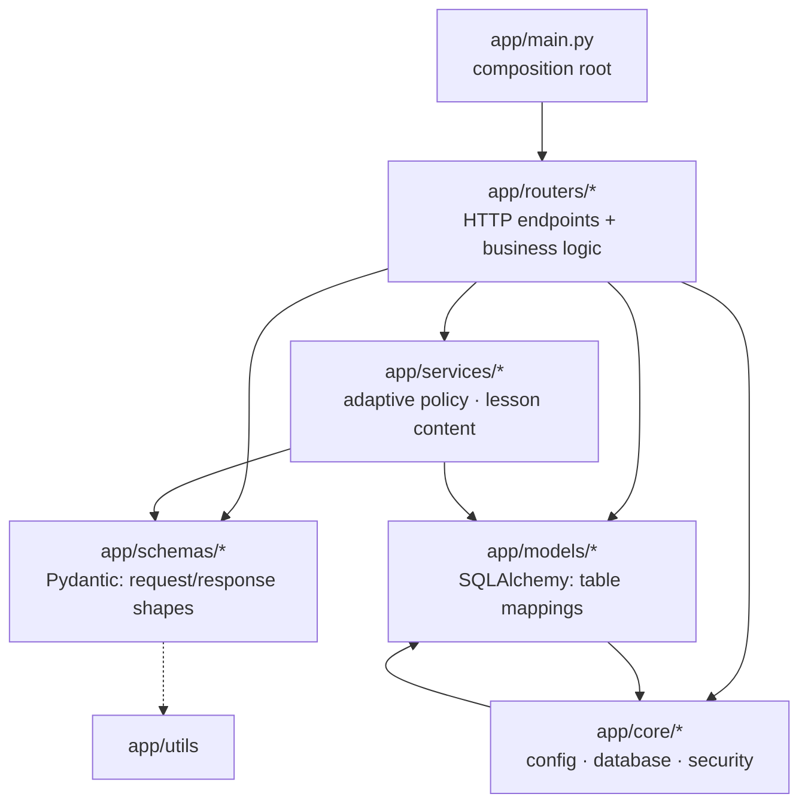

# Architecture

## Repository layout

```
vcFastApi/
├── app/                      # The application package (everything served by Uvicorn)
│   ├── main.py               # Creates the FastAPI app, wires middleware, routers, static files
│   ├── core/                 # Cross-cutting infrastructure
│   │   ├── config.py         # Settings loaded from environment / .env
│   │   ├── database.py       # SQLAlchemy engine, session factory, Base, get_db dependency
│   │   └── security.py       # Password hashing, JWT creation/decoding, get_current_user
│   ├── models/               # SQLAlchemy ORM classes (database tables)
│   │   ├── usersModel.py             → public.users
│   │   ├── moduleMasterModel.py      → modules.modules_master
│   │   ├── subModuleMasterModel.py   → modules.sub_modules_master
│   │   ├── learningCourseModel.py    → modules.learning_* (courses, preferences, progress,
│   │   │                               attempts, concepts, practice_questions)
│   │   └── contentModel.py           → modules.learning_content_generations
│   ├── schemas/              # Pydantic models (request/response shapes)
│   │   ├── schemas.py        # Auth + profile shapes
│   │   ├── learning.py       # Course document + learning request shapes
│   │   ├── adaptive.py       # Revision concept, adaptive question, practice bank
│   │   └── content.py        # Generated lesson shape (sections, examples, takeaways)
│   ├── routers/              # One APIRouter per feature; endpoint functions live here
│   │   ├── auth.py           # /auth
│   │   ├── profile.py        # /profile
│   │   ├── moduleMaster.py   # /module
│   │   └── learning.py       # /learning
│   ├── services/             # Business logic shared by routers and scripts
│   │   ├── adaptive.py       # Concept evidence, difficulty policy, practice-set selection
│   │   ├── content.py        # Explanation-depth selection, cached lesson lookup (request path)
│   │   └── content_generation.py  # Provider calls for lesson generation (operator scripts only)
│   └── utils/
│       └── country_codes.py  # Static list of countries and dial codes
├── data/
│   ├── ncert-maths-10-v1.json        # The published course document (seeded into PostgreSQL)
│   └── <chapter>-practice-v1.json    # 14 adaptive practice banks (5 concepts + 45 MCQs each)
├── db/
│   ├── migration/                    # Flyway migrations V0–V3 (the schema's source of truth)
│   ├── dev/                          # Local/CI-only repeatable seed (Maths subject)
│   └── init/                         # Local/CI-only Postgres init (admin role)
├── scripts/
│   ├── seed_learning.py              # Publishes the course (--content-only skips V1 DDL)
│   ├── verify_learning_db.py         # Read-only check that the DB matches data/ and the migration
│   ├── build_real_numbers_bank.py    # Regenerate data/real-numbers-practice-v1.json
│   ├── build_polynomials_bank.py     # Regenerate data/polynomials-practice-v1.json
│   ├── build_class10_banks.py        # Regenerate the banks for chapters 3–14
│   ├── seed_adaptive.py              # Publishes practice banks (--content-only skips V2 DDL)
│   ├── verify_adaptive_db.py         # Read-only check of published banks and runtime-role access
│   └── generate_content.py           # Operator-only: pre-generate adapted lessons
├── tests/
│   ├── test_auth.py                  # Auth + profile regressions (SQLite, no network)
│   ├── test_learning.py              # Course, tests, attempts, grading, reset
│   ├── test_adaptive.py              # Real Numbers adaptive policy and endpoints
│   ├── test_polynomials.py           # Polynomials bank and answer keys
│   ├── test_class10_adaptive.py      # Chapters 3–14 coverage and end-to-end flow
│   ├── class10_answer_keys.py        # Independently worked answers for chapters 3–14
│   └── test_content.py               # Content pipeline (mocked provider HTTP)
├── .github/workflows/db-migrate.yml  # Verify migrations in CI, apply to remote on master
├── docker-compose.yaml       # Local stack: db, flyway, seed, api, web (see docs/local-runner.md)
├── Dockerfile
├── requirements.txt
├── .env.example              # Settings for running the app directly on the host
├── .env.docker.example       # Settings for docker compose
├── LEARNING.md               # Feature documentation for the learning module
├── ADAPTIVE.md               # Adaptive practice policy, publishing and rollout
├── CLASS10_CONTENT.md        # Chapter-by-chapter adaptive coverage and limits
├── CONTENT_PIPELINE.md       # Lesson generation: providers, rollout, cache identity
└── docs/                     # This documentation set
```

## Layers

The code is organised into four layers. Arrows show the allowed import direction: a layer may import from anything below it.



| Layer | Responsibility | Knows about |
| --- | --- | --- |
| **main** | Build the app object; register middleware, routers and mounts; run startup work. | Everything |
| **routers** | Receive validated requests, apply business rules, talk to the database, return responses. | services, schemas, models, core |
| **services** | Business logic that is too large for a router or is shared with scripts (adaptive selection, lesson depth, lesson generation). | schemas, models |
| **schemas** | Define what JSON is accepted and returned. Enforce field-level rules. | Nothing else in `app/` (except `utils` for the dial-code list) |
| **models** | Map Python classes to database tables. | `core.database.Base` |
| **core** | Settings, DB engine/session, auth primitives. | `models.usersModel` (security needs the `User` table) |

Two observations about the current state:

- **Business logic mostly lives in the routers**, with a service layer for the larger pieces. `app/services/adaptive.py` holds the practice policy (evidence, difficulty, question selection) and `app/services/content.py` the lesson-depth and cached-lesson lookup; both are called from `routers/learning.py`. `app/services/content_generation.py` is only imported by `scripts/generate_content.py`, which keeps provider HTTP calls off the student request path. Smaller helpers such as `load_course`, `lock_progress` and `progress_view` still sit in the router file; move them into `services/` when something else needs them.
- **`core.security` imports `models.usersModel`.** This creates a small cycle (`core → models → core.database`) that Python tolerates because `database.py` does not import back. Keep `database.py` free of model imports to preserve that.

## Composition root: `app/main.py`

Everything is assembled in one file, top to bottom:

```python
# 1. Create the app. (No table creation: the schema is owned by Flyway.)
app = FastAPI(title="vcFastApi Auth")

# 2. Middleware.
app.add_middleware(CORSMiddleware, ...)

# 3. Ensure the uploads directory exists and serve it statically.
app.mount("/uploads", StaticFiles(directory=str(UPLOADS_DIR)), name="uploads")

# 4. Plug in the feature routers.
app.include_router(auth.router)
app.include_router(profile.router)
app.include_router(moduleMaster.router)
app.include_router(learning.router)

# 5. A health probe.
@app.get("/health")
```

Because these statements run at import time, importing `app.main` has side effects: it loads settings (so `DATABASE_URL` and `JWT_SECRET` must be set), creates the database engine, and creates the `uploads/` directory. This is why the test files set `DATABASE_URL=sqlite://` before importing anything from `app`, and why the tests import routers directly rather than `app.main`.

### The app does not create tables

Earlier versions called `Base.metadata.create_all` at startup for `public.users`. That was removed when Flyway took over: every table, including `users`, now comes from `db/migration/`. Starting the app against an empty database therefore fails on the first query until Flyway has run. `docker compose up` does this for you. See [03 – Database](03-database.md#5-schema-changes-and-migrations).

## Feature modules

| Router | Prefix | Purpose | Auth |
| --- | --- | --- | --- |
| `auth.py` | `/auth` | Sign-up, password login, Google sign-in, "who am I" | Public except `/auth/me` |
| `profile.py` | `/profile` | Onboarding, profile read/update, avatar upload/delete, country-code list | Bearer token except `/profile/country-codes` |
| `moduleMaster.py` | `/module` | Read-only listing of modules and sub-modules (subjects) | **None** |
| `learning.py` | `/learning` | Level preferences, course/chapter content, tests, attempts, grading, reset, adaptive practice and insights, adapted lesson versions | Bearer token on every route |

Full endpoint details are in [05 – API Reference](05-api-reference.md). The learning feature is documented in depth in [LEARNING.md](../LEARNING.md); adaptive practice and the lesson content pipeline are explained in [07 – Adaptive Learning](07-adaptive-learning.md).

## How a feature is wired (pattern to copy)

Adding a new feature means touching four places. Using the profile feature as the template:

1. **Model** – `app/models/usersModel.py` defines the table (here the existing `User`).
2. **Schemas** – `app/schemas/schemas.py` defines `OnboardingIn`, `ProfileUpdate`, `ProfileOut`.
3. **Router** – `app/routers/profile.py` creates `router = APIRouter(prefix="/profile", tags=["profile"])` and decorates endpoint functions. Each endpoint asks for what it needs via `Depends`: `db: Session = Depends(get_db)` and `user: User = Depends(get_current_user)`.
4. **Registration** – `app/main.py` calls `app.include_router(profile.router)`.

Nothing else needs to change. There is no registry, no configuration file, and no scanning of packages: if `main.py` does not call `include_router`, the routes do not exist.

## Configuration

All configuration is in [app/core/config.py](../app/core/config.py) as a `Settings` class. Values come from environment variables, falling back to a `.env` file in the working directory.

| Variable | Required | Default | Used for |
| --- | --- | --- | --- |
| `DATABASE_URL` | yes | – | SQLAlchemy connection string for the app. In production this is the pooled Neon URL. |
| `DATABASE_URL_UNPOOLED` | no | – | Direct (non-pooled) schema-owner URL used by the migration/publishing scripts (`seed_learning.py`, `seed_adaptive.py`, `generate_content.py`). |
| `JWT_SECRET` | yes | – | HMAC key for signing access tokens. |
| `JWT_ALGORITHM` | no | `HS256` | JWT signing algorithm. |
| `ACCESS_TOKEN_EXPIRE_MINUTES` | no | `60` | Token lifetime. |
| `GOOGLE_CLIENT_ID` | no | – | OAuth client ID for verifying Google ID tokens. If unset, `POST /auth/google` returns 503. |
| `CORS_ORIGINS` | no | localhost dev origins | Comma-separated exact origins allowed by CORS. |
| `CORS_ORIGIN_REGEX` | no | `https://([a-z0-9-]+\.)?vercel\.app` | Regex for additional allowed origins. |
| `UPLOADS_DIR` | no | `uploads` | Directory for avatar files. Ephemeral on most PaaS hosts unless a volume is mounted. |
| `CONTENT_PIPELINE_ENABLED` | no | `false` | When true, `GET /learning/.../chapters/{id}` selects an explanation depth and serves a stored adapted lesson. Enable only after Flyway V3 is applied. |
| `CONTENT_PROVIDER` | no | `openai-compatible` | Lesson-generation protocol: `openai-compatible`, `openai` or `anthropic`. Operator scripts only. |
| `CONTENT_API_BASE_URL` | no | – | HTTPS base URL of the provider (e.g. NVIDIA NIM, OpenRouter, OpenAI, Anthropic). Operator scripts only. |
| `CONTENT_API_KEY` | no | – | Provider key. Needed only where `generate_content.py` runs, never by the serving app. |
| `CONTENT_MODEL` | no | – | Exact provider model ID. |
| `CONTENT_OUTPUT_MODE` | no | `json_object` | `json_object`, `json_schema` or `text`; pick one the model supports. |

`settings` is a module-level instance. Import it with `from ..core.config import settings`. Missing required variables cause an error at import, so a misconfigured deployment fails immediately instead of on the first request.

## Import style

The codebase mixes two import styles, both of which work:

```python
from ..core.database import get_db          # relative (most files)
from app.routers import moduleMaster        # absolute (main.py, moduleMaster.py)
```

Relative imports require the code to run as part of the `app` package, which is always the case here (`uvicorn app.main:app`, `python -m scripts...`, `python -m unittest`). Prefer relative imports within `app/` for consistency.

## Naming conventions

- Files under `models/` and `routers/` use camelCase (`usersModel.py`, `moduleMaster.py`); the rest of the code uses snake_case, which is the Python convention. New files should use snake_case.
- Table names are snake_case, plural or `_master` suffixed.
- JSON keys in the learning API are camelCase (`subjectId`, `finalUnlocked`) to match the frontend; JSON keys in auth/profile are snake_case (`full_name`, `access_token`). Be aware of this when adding fields.

Next: [03 – Database](03-database.md).
