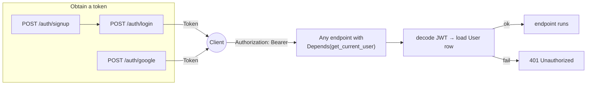
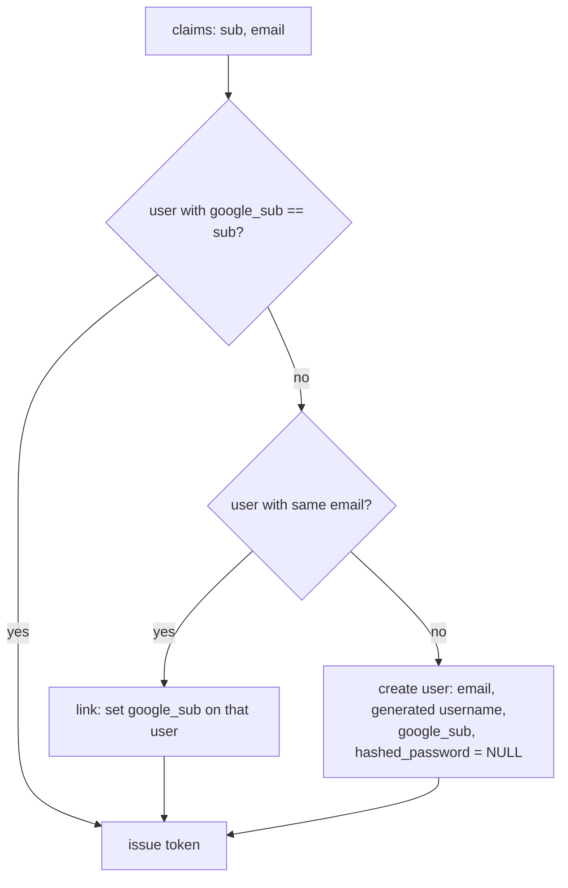

# Authentication

The app issues stateless **JWT bearer tokens**. A client obtains a token by password login or Google sign-in, then sends it as `Authorization: Bearer <token>` on protected requests. All of the machinery lives in [app/core/security.py](../app/core/security.py) and [app/routers/auth.py](../app/routers/auth.py).

## 1. Overview



There are no sessions, cookies or refresh tokens. A token is valid until its expiry (`ACCESS_TOKEN_EXPIRE_MINUTES`, default 60) and cannot be revoked before then.

## 2. Password storage

```python
pwd_context = CryptContext(schemes=["bcrypt"], deprecated="auto")

def hash_password(password: str) -> str:
    return pwd_context.hash(password)

def verify_password(plain: str, hashed: str) -> bool:
    return pwd_context.verify(plain, hashed)
```

Passwords are hashed with bcrypt via `passlib`. Only the hash is stored (`users.hashed_password`). `bcrypt` is pinned to `4.0.1` because newer versions changed an internal attribute that `passlib 1.7.4` reads; upgrading one without the other produces a warning or error when hashing.

`hashed_password` is nullable: accounts created through Google sign-in have no password. `login` checks for this explicitly, because `passlib.verify` raises on `None` rather than returning `False`.

## 3. Sign-up and password login

**`POST /auth/signup`** – JSON body `{email, username, password}`. Rejects with `409` if either the email or the username is taken. Returns the created user (without the hash).

**`POST /auth/login`** – form-encoded body, not JSON:

```
username=<email>&password=<password>
```

This shape comes from `OAuth2PasswordRequestForm`, which implements the OAuth2 "password grant" request format. The field is called `username` by the spec, but this app expects the **email** in it. On success:

```json
{"access_token": "<jwt>", "token_type": "bearer"}
```

The token's subject (`sub`) is the user's numeric `id` as a string.

Both wrong-email and wrong-password return the same `401 Invalid credentials`, so the endpoint does not reveal whether an email is registered.

## 4. Token format

```python
def create_access_token(subject: str, expires_delta=None) -> str:
    expire = datetime.now(timezone.utc) + (expires_delta or timedelta(minutes=settings.access_token_expire_minutes))
    payload = {"sub": subject, "exp": expire}
    return jwt.encode(payload, settings.jwt_secret, algorithm=settings.jwt_algorithm)
```

- Signed with HMAC-SHA256 (`HS256`) using `JWT_SECRET`. Anyone who knows the secret can mint valid tokens, so it must be long, random and never committed.
- Claims: `sub` (user id) and `exp` (expiry). Nothing else; no roles or email are embedded.
- Library: `python-jose`.

## 5. Protecting an endpoint: `get_current_user`

```python
oauth2_scheme = OAuth2PasswordBearer(tokenUrl="/auth/login")

def get_current_user(token: str = Depends(oauth2_scheme), db: Session = Depends(get_db)) -> User:
    ...
    payload = jwt.decode(token, settings.jwt_secret, algorithms=[settings.jwt_algorithm])
    user_id = payload.get("sub")
    ...
    user = db.query(User).filter(User.id == int(user_id)).first()
    if user is None:
        raise credentials_exc
    return user
```

Two dependencies chained:

1. **`oauth2_scheme`** reads the `Authorization` header, checks it starts with `Bearer `, and returns the token string. If the header is missing it raises `401` on its own. The `tokenUrl` is informational: it tells the OpenAPI docs where to log in so the "Authorize" button in `/docs` works.
2. **`get_current_user`** decodes and verifies the signature and expiry (`jwt.decode` raises `JWTError` on either), then loads the user row. A token for a deleted user is rejected because the row lookup fails.

To require authentication on an endpoint, add the parameter:

```python
@router.get("/me", response_model=UserOut)
def me(current_user: User = Depends(get_current_user)) -> User:
    return current_user
```

The endpoint receives a fully loaded `User` ORM object. Because dependencies are cached per request, an endpoint that declares both `Depends(get_db)` and `Depends(get_current_user)` shares one session between them.

There is no role or permission system. Every authenticated user has the same access; ownership is enforced inside endpoints by filtering on `user.id` (e.g. `owned_attempt` in the learning router).

## 6. Google sign-in

**`POST /auth/google`** – JSON body `{"credential": "<Google ID token>"}`.

The frontend obtains an ID token from Google Identity Services and posts it here. The server:

1. Returns `503` if `GOOGLE_CLIENT_ID` is not configured.
2. Verifies the token with `google.oauth2.id_token.verify_oauth2_token`, which checks Google's signature, expiry, and that the token was issued for this client ID. Invalid → `401`.
3. Rejects accounts whose email Google has not verified → `401`.
4. Finds or creates the local user:



Linking by email means a user who signed up with a password and later clicks "Sign in with Google" using the same address gets one account, not two. The generated username is the email's local part, sanitised to `[a-z0-9_-]`, with a numeric suffix appended until it is unique (`_unique_username`).

The resulting token is identical in format to a password-login token; downstream code cannot tell the two apart.

## 7. Public vs protected routes

| Public (no token) | Protected (`Depends(get_current_user)`) |
| --- | --- |
| `GET /health` | `GET /auth/me` |
| `POST /auth/signup` | everything under `/profile` except `country-codes` |
| `POST /auth/login` | everything under `/learning` |
| `POST /auth/google` | |
| `GET /profile/country-codes` | |
| `GET /module/getModules/`, `GET /module/getSubModules/` | |
| `GET /uploads/...` (static files) | |

The `/module/*` endpoints return catalogue data with no authentication. If that data should not be world-readable, add the `get_current_user` dependency to that router.

## 8. Calling the API from a client

```bash
# 1. Sign up
curl -X POST http://localhost:8000/auth/signup \
  -H 'Content-Type: application/json' \
  -d '{"email":"a@example.com","username":"alice","password":"correct-horse-battery"}'

# 2. Log in (form-encoded; note username=<email>)
TOKEN=$(curl -s -X POST http://localhost:8000/auth/login \
  -d 'username=a@example.com&password=correct-horse-battery' | python -c 'import sys,json;print(json.load(sys.stdin)["access_token"])')

# 3. Call a protected endpoint
curl http://localhost:8000/profile/me -H "Authorization: Bearer $TOKEN"
```

In Swagger UI (`/docs`), click **Authorize**, enter the email as username plus the password, and every subsequent "Try it out" call carries the token.

## 9. Things to be aware of

- **Token lifetime.** `.env.example` sets `ACCESS_TOKEN_EXPIRE_MINUTES=3600` (60 hours) for convenience. Shorten it for production, or add a refresh-token flow.
- **No logout / revocation.** Stateless JWTs cannot be invalidated server-side without a denylist. Rotating `JWT_SECRET` invalidates all tokens at once.
- **`JWT_SECRET` must be strong.** The example value `supersecretkey` is a placeholder.
- **Email is the login identifier**, but `username` is also unique and user-editable (`PATCH /profile/me`). Both are indexed.
- **Google verification makes an outbound HTTPS call** to fetch Google's public keys. The tests mock this out.

Next: [05 – API Reference](05-api-reference.md).
