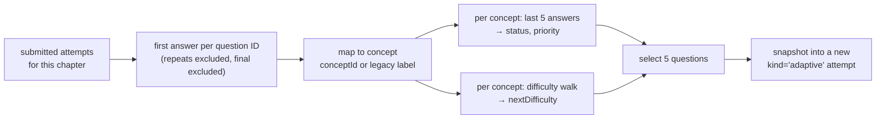
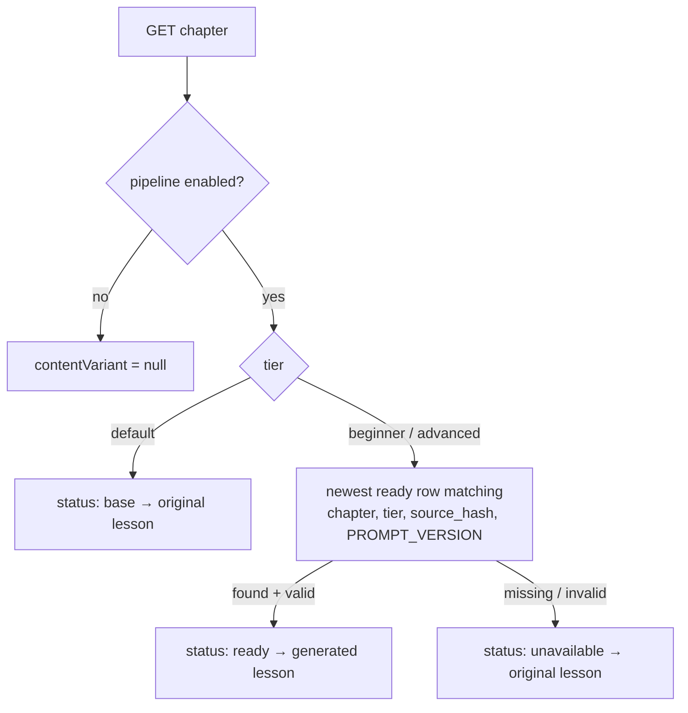

# Adaptive Learning

The learning module has two adaptive features on top of the fixed course:

1. **Adaptive practice.** Short, focused question sets that the server picks for each student, based on how they have answered so far, concept by concept.
2. **Adapted lesson content.** The same chapter lesson at a different explanation depth (Beginner / Default / Advanced), chosen from the student's results and served from content generated ahead of time.

Both are deterministic on the request path. No model is called while a student is using the app. This page explains how the pieces fit together. The operational runbooks live at the repository root: [ADAPTIVE.md](../ADAPTIVE.md), [CLASS10_CONTENT.md](../CLASS10_CONTENT.md) and [CONTENT_PIPELINE.md](../CONTENT_PIPELINE.md).

## 1. Where things live

| Concern | Code | Data |
| --- | --- | --- |
| Concept and question shapes | [app/schemas/adaptive.py](../app/schemas/adaptive.py) (`Concept`, `AdaptiveQuestion`, `PracticeBank`) | `data/<chapter>-practice-v1.json` |
| Evidence, difficulty and selection policy | [app/services/adaptive.py](../app/services/adaptive.py) | `modules.learning_concepts`, `modules.learning_practice_questions`, `modules.learning_attempts` |
| Explanation depth and lesson lookup | [app/services/content.py](../app/services/content.py) | `modules.learning_content_generations` |
| Lesson generation (operator only) | [app/services/content_generation.py](../app/services/content_generation.py), [scripts/generate_content.py](../scripts/generate_content.py) | same table |
| HTTP endpoints | [app/routers/learning.py](../app/routers/learning.py) | – |

## 2. Adaptive practice

### Content

Each of the 14 Class 10 chapters has a **practice bank**: five revision concepts and 45 multiple-choice questions (each concept × three difficulties × three variants). That is 70 revision cards and 630 questions in total. A revision card has an explanation, a worked example, a common mistake and a checklist. Every concept also lists `legacyLabels`, the concept names used by the original fixed chapter-test questions, so answers from those tests count as evidence too.

Banks are generated by the `scripts/build_*` builders into `data/`, checked by the tests, and published with `scripts/seed_adaptive.py`. Published question documents are immutable. If a question needs a fix, it gets a new ID; the seed refuses to overwrite a changed document. Chapter availability is discovered from `learning_concepts` at request time, so publishing a new bank needs no code change.

### Attempts share one table

Adaptive sets are ordinary rows in `learning_attempts` with `kind = 'adaptive'`, alongside `chapter` and `final` attempts. So the existing draft, submit, revision-check, ownership and reset logic serves all three. The separation rules are:

- The draft index includes `kind`, so a chapter-test draft and a practice draft for the same chapter can both be open.
- Official history (`ProgressView.history`, `GET /tests/...`) and the final-test gate ignore adaptive attempts. Practice never unlocks the final test.
- Course reset deletes all three kinds, which also clears the derived evidence.

### Policy `concept-practice-v1`

**Evidence** (`concept_evidence`). Only the first submitted answer to each question ID counts. Questions repeated after the bank runs out are excluded. For each concept, the five most recent counted answers give its signal:

| Counted answers / score | `status` |
| --- | --- |
| fewer than 3 | `insufficient` |
| below 60% | `revise` |
| 60% to below 80% | `practise` |
| 80% or more | `positive` |

A concept whose most recent answer was wrong, or that is at `revise`, gets priority 0 (revise first).

**Difficulty.** Every concept starts at `standard`. A wrong first answer drops it to `foundation`. Three correct answers in a row at the current level move it up one level. Two misses among the last three answers at the current level move it down one level. The window resets after each move.

**Selection** (`select_questions`). The service loads only the metadata of the approved questions, then:

1. Excludes every question already shown to the student, including questions in drafts.
2. Fills up to three slots from priority-0 concepts, then covers other concepts.
3. For each slot, picks the question closest to that concept's `nextDifficulty`. Ties go to the easier question, then to the lower ID.
4. Once every question in the bank has been shown, it reuses questions and labels the set `mode: "revision"` in `selection_metadata`.

Only the five chosen documents are then loaded and validated. They are saved in the attempt's snapshot, so reopening the set resumes exactly those questions. The client never sends a difficulty, score or question list.

These thresholds are product heuristics, not validated measures of mastery. The banks have not been reviewed by a teacher.

## 3. Adapted lesson content

### Choosing a depth (`explanation_depth`)

This runs only when `CONTENT_PIPELINE_ENABLED=true` and the chapter has adaptive content. It reuses the same evidence as practice:

- If there are fewer than 10 counted answers, or any concept has none → **Default** (`reason: "more-evidence-needed"`).
- Otherwise, overall correctness below 60% → **Beginner**, 60% to below 80% → **Default**, 80% or more → **Advanced** (`reason: "chapter-results"`).

Default serves the original lesson unchanged. Resetting results resets the depth, and the student's education level is never changed.

### Serving (`cached_lesson`)

`source_hash` is a SHA-256 of the chapter lesson plus its revision cards. Assessment questions, answers and user data are not part of the source. If the lesson changes, or `PROMPT_VERSION` in `services/content.py` is bumped, old generations stop matching, and the app falls back to the original lesson until the content is regenerated. The newest ready row wins across providers, so switching providers does not throw away content that is already prepared.

### Generating (operator only)

`scripts/generate_content.py` builds the source document for a chapter and tier, and hands it to `generate()`:

1. It computes a `cache_key` from the source hash, tier, prompt version, provider, endpoint, model and output mode. If a `pending` or `ready` row already has that key, the script reuses it.
2. It inserts a `pending` row and **commits before the provider call**. The partial unique index on `cache_key` stops concurrent publishers from duplicating a call.
3. It calls the provider (`request_lesson`). The provider can be `anthropic` (Messages API with a JSON schema) or `openai` / `openai-compatible` (Chat Completions with `response_format` set by `CONTENT_OUTPUT_MODE`). Output is capped at 6000 tokens, with a 10 s connect and 90 s read timeout, and redirects are not followed.
4. It validates the output locally against `GeneratedLesson`: 2–8 sections, each with explanation, worked example and self-check, plus 2–8 takeaways, all plain text. The row becomes `ready`. A refusal, truncation, HTTP error or invalid JSON makes it `failed`, with an `error_code`.

Failed rows are kept, and nothing is retried automatically. The script holds a session advisory lock so only one publisher runs at a time. `verified` stays `false` until a person reviews the content; the API returns it so the UI can label lessons as unreviewed.

### Rollout state

The pipeline is disabled by default (`CONTENT_PIPELINE_ENABLED=false`). While it is disabled, the app does not touch `learning_content_generations`, so deploying the code before the V3 migration is safe. V3 is now applied by the Flyway pipeline. As of 24 September 2026, live generation has not been run against the app database. [CONTENT_PIPELINE.md](../CONTENT_PIPELINE.md) has the step-by-step rollout. All 14 practice banks were published to the app database on 17 September 2026.

## 4. Endpoints at a glance

| Method | Path | Purpose |
| --- | --- | --- |
| `GET` | `/learning/courses/{c}/chapters/{ch}` | Lesson, plus `adaptiveAvailable` and `contentVariant` |
| `GET` | `/learning/courses/{c}/chapters/{ch}/insights` | Revision cards + per-concept evidence |
| `GET` | `/learning/courses/{c}/chapters/{ch}/practice` | Current/latest practice set, adaptive history, insights |
| `POST` | `/learning/courses/{c}/chapters/{ch}/practice` | Start or resume a server-selected practice set |
| `PUT` / `POST` | `/learning/courses/{c}/attempts/{id}/draft` · `/submit` | Save / grade; adaptive submit also returns updated `insights` |
| `GET` | `/learning/content/{generation_id}` | A specific stored adapted lesson (`410` if its source is outdated) |

Full shapes and errors: [05 – API Reference](05-api-reference.md#learning--learning).

## 5. Changing things safely

- **Adjusting thresholds or selection.** Edit `app/services/adaptive.py`. The policy name `POLICY` is stored in each attempt's `selection_metadata`, so bump it when behaviour changes meaningfully. Add a case to `tests/test_adaptive.py`.
- **Editing questions.** Change the builder, give changed questions new IDs, regenerate `data/`, run the tests, then run `seed_adaptive --bank <name> --content-only`. Saved snapshots are never rewritten.
- **Changing the lesson prompt or `GeneratedLesson` schema.** Bump `PROMPT_VERSION` and regenerate. Until then, students get the original lesson.
- **Adding a provider.** Extend `validate_provider` and `request_lesson` in `content_generation.py`. The serving side needs no change.

Back to [README](../README.md).
