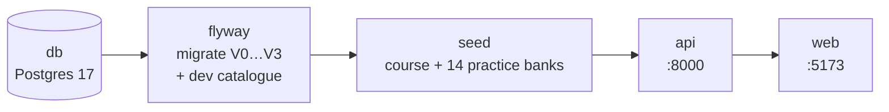

# Running vCHITR Locally

One command starts the whole application on your machine: a PostgreSQL 17 database, the FastAPI backend and the React frontend. The database schema is built by Flyway from the same migration files that production uses. Course content is loaded from `data/`. You do not need access to the remote (Neon) database.

```
http://localhost:5173   frontend (Vite, hot reload)
http://localhost:8000   backend API (Uvicorn, auto-reload)   → /docs for Swagger UI
localhost:5432          PostgreSQL 17 (user/password/db: vchitr)
```

## 1. Prerequisites

- **Docker** with the Compose plugin (`docker compose version` should print v2 or later). Docker Desktop on macOS/Windows is fine. On Linux, make sure your user can run `docker` without `sudo` (see [Troubleshooting](#7-troubleshooting)).
- **Git access** to both repositories.
- About 3 GB of free disk space for images.

You do **not** need Python, Node or PostgreSQL installed on your machine.

## 2. Get the code

Clone both repositories **side by side** in the same parent folder:

```bash
mkdir vchitr && cd vchitr
git clone https://github.com/xdh4uv/vcFastApi.git
git clone <vchitr-frontend repository URL> vchitr-frontend
```

```
vchitr/
├── vcFastApi/          ← docker-compose.yaml lives here
└── vchitr-frontend/
```

If you keep the frontend elsewhere, set `FRONTEND_DIR=/path/to/vchitr-frontend` in your shell before running Compose.

## 3. Configure

```bash
cd vcFastApi
cp .env.docker.example .env.docker
```

The defaults work as they are. Things you might change in `.env.docker`:

| Variable | When to change it |
| --- | --- |
| `GOOGLE_CLIENT_ID`, `VITE_GOOGLE_CLIENT_ID` | To test "Sign in with Google". Use the same client ID in both, and ask a maintainer to add `http://localhost:5173` to the client's authorised JavaScript origins. Leave both blank to use email/password only. |
| `CONTENT_PIPELINE_ENABLED` | Only if you are working on adapted lessons. See [07 – Adaptive Learning](07-adaptive-learning.md). |

`.env.docker` is git-ignored. Database URLs are set by `docker-compose.yaml` itself and always point at the local container.

## 4. Start

```bash
docker compose up
```

The first run takes a few minutes, because it downloads images, installs Python packages and runs `npm ci`. Later starts take seconds. The services start in this order:



`flyway` and `seed` run once and exit. That is expected, and they show as `Exited (0)`. When you see `VITE ... ready` in the logs, open **http://localhost:5173**, sign up with any email and password, and choose **Learning → Maths**.

Add `-d` to run in the background, then use `docker compose logs -f api web` to follow the logs.

## 5. Daily workflow

| Task | Command |
| --- | --- |
| Start / stop | `docker compose up -d` / `docker compose down` |
| Follow logs | `docker compose logs -f api` (or `web`, `db`, `flyway`) |
| Run backend tests | `docker compose exec api python -m unittest discover -s tests` |
| Open a SQL shell | `docker compose exec db psql -U vchitr` |
| Run a backend script | `docker compose exec api python -m scripts.<name>` |
| Re-run migrations after adding one | `docker compose up flyway` |
| Rebuild after changing `requirements.txt` | `docker compose up -d --build` |
| Start over with an empty database | `docker compose down -v && docker compose up` |

**Code changes apply automatically.** Both repositories are mounted into the containers: saving a Python file restarts Uvicorn, and saving a frontend file hot-reloads the browser. Frontend dependencies are reinstalled automatically when `package-lock.json` changes.

**Connecting a GUI client** (DBeaver, pgAdmin, TablePlus): host `localhost`, port `5432` (or your `DB_PORT`), user, password and database are all `vchitr`.

**Your data persists** in the `pgdata` volume across `down`/`up`. Only `down -v` erases it, and it also erases uploaded avatars and the cached `node_modules`.

## 6. Changing the database schema

The database schema is owned by **Flyway**. The app never creates or alters tables on its own.

1. Add a new file to `db/migration/` named with the **next** version number:

   ```
   db/migration/V4__add_user_timezone.sql
   ```

   The format is `V<number>__<description>.sql`, with **two** underscores. Never edit or rename a file that has already been merged: Flyway checksums every applied migration and will refuse to run if one changes.

2. Apply it locally and check the result:

   ```bash
   docker compose up flyway
   docker compose exec db psql -U vchitr -c '\d public.users'
   ```

3. Update the SQLAlchemy model in `app/models/` to match, and add tests.

4. Open a pull request. The **Database migrations** GitHub Actions workflow replays every migration on a fresh PostgreSQL 17 and publishes the course content on top, so a broken migration fails there.

5. When the PR is merged to `master`, the same workflow applies the new migration to the remote database. You never run migrations against remote yourself.

Write migrations that are **safe while the previous backend version is still running**. For example: add a nullable column now, backfill it, and add `NOT NULL` in a later migration; add a new column before removing an old one. The migration runs before the new backend is deployed.

`db/dev/` holds local-only data (currently a `Maths` subject row). Flyway applies it locally and in CI, but **never** to remote. Put fixtures that only developers need there, not in `db/migration/`.

## 7. Troubleshooting

**`permission denied while trying to connect to the docker API` (Linux).** Your user is not allowed to use the Docker daemon. Either run `sudo usermod -aG docker $USER` and log out and back in, or use rootless Podman: `systemctl --user enable --now podman.socket`, then `export DOCKER_HOST=unix://$XDG_RUNTIME_DIR/podman/podman.sock`.

**`port is already allocated` / `address already in use` on 5432.** You already have PostgreSQL running locally. Pick another host port: `DB_PORT=55432 docker compose up`. Only your GUI client needs to know about this; the containers still talk to each other on 5432. Ports 8000 and 5173 must be free, because the frontend and Google sign-in expect them.

**Containers can't read files / `Permission denied` inside `/app` (Fedora, RHEL).** The compose file already labels its bind mounts with `:z` for SELinux. If you add a mount of your own, add `:z` to it too.

**`flyway` exits with `Validate failed: Migration checksum mismatch`.** A migration that was already applied to your local database has been edited. If the edit was yours, revert it and add a new `V<n>` file instead. If you just pulled someone else's history rewrite, run `docker compose down -v` and start over.

**`seed` fails with `An existing course version differs` / `Published question differs`.** Your local database holds an older copy of a course or question bank that has since been changed under the same ID. Reset with `docker compose down -v && docker compose up`.

**Frontend shows `Network Error` or CORS errors.** Check that the API is up (`curl localhost:8000/health`) and that you opened `http://localhost:5173` or `http://127.0.0.1:5173`. Other origins, such as a LAN IP, are not in the default CORS list. Google sign-in only works on the exact origin registered with Google, normally `http://localhost:5173`.

**Google button missing or `503 Google Sign-In not configured`.** Set both Google variables in `.env.docker`, then run `docker compose up -d --force-recreate api web`.

**Changes to `.env.docker` are ignored.** Environment files are read when a container is created, not on reload. Run `docker compose up -d --force-recreate api web`.

**Anything else.** `docker compose ps -a` shows which service failed; `docker compose logs <service>` shows why.

## 8. What is different from production

| | Local | Production |
| --- | --- | --- |
| Database | Postgres 17 in Docker, schema from Flyway, catalogue from `db/dev/` | Neon (Postgres 17), migrated by CI on merge to `master` |
| Data | Only what you create, plus the published course and practice banks | Real users and results. Never copy it to your machine. |
| Subjects | One `Maths` row with a fixed local ID | Whatever the catalogue holds |
| Lesson variants | Off (`CONTENT_PIPELINE_ENABLED=false`) | Controlled by deployment config |
| Avatars | `uploads` Docker volume | Deployment's `UPLOADS_DIR` |

More background: [06 – Development](06-development.md) · [03 – Database](03-database.md#5-schema-changes-and-migrations).
